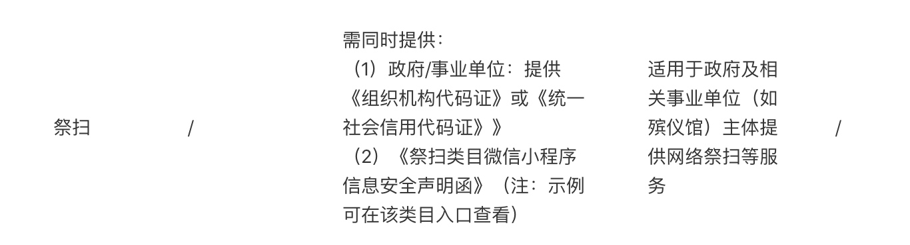
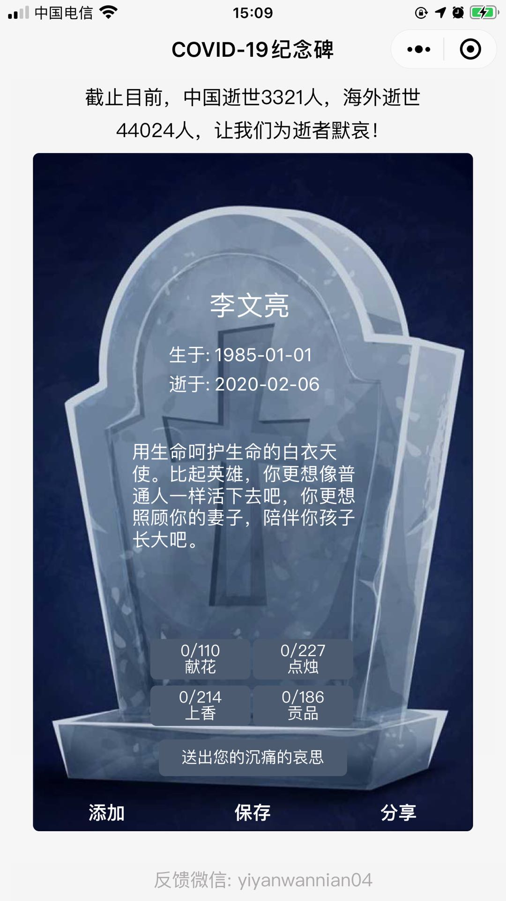

# COVID19纪念碑 （新冠纪念碑）

COVID-19肆掠以来，国内国外疫情日益严重，在和病毒搏斗的过程，大部分患者在祖国和医生的倾力相助下转危为安，感谢我们强大的祖国，感谢奋斗在一线的白衣天使！但是依然有众多鲜活的人生命戛然而止，黯然失色，愿逝者一路走好，愿天堂再无痛苦！也留下的亲人朋友深深的怀恋! `COVID19纪念碑`(新冠纪念碑)小程序致力于为大家提供一个方便的寄托哀思的地方，也提醒我们珍爱生命，敬畏大自然，和大自然和平相处！同时疫情还未结束，很多地方清明祭祖也不方便线下祭祖，此小程序正好可以提供线上祭祖的用户需求。

## GitHub
- [COVID-19-Monument](https://github.com/huomaoyi/COVID-19-Monument)

## 当前疫情状态

- [丁香医生](https://ncov.dxy.cn/ncovh5/view/pneumonia?from=singlemessage&isappinstalled=0)
- [Coronavirus disease (COVID-19) Situation Dashboard](https://experience.arcgis.com/experience/685d0ace521648f8a5beeeee1b9125cd)

## 目前完成度
- 目前已完成基本的创建和分享逝者墓碑的功能，用户也能在墓碑上献花、点烛、上香、上贡品，已经能正常上线使用
- 数据库：使用小程序云开发服务，无需单独数据库
  
## 考虑需要完善的地方
- UI优化：当前小程序还未做UI优化
- 添加歌颂模块：歌颂为新冠作出突出贡献的普通人，为平凡的英雄打call
- 添加广场：让用户能看到其他人和自己为逝者献出哀思的记录（通过献花、点烛、上香、上贡品数呈现），也让用户看到其他人和自己为英雄打call的记录
- 国际版： 由于目前逝世者外国数目惊人，考虑是否将来推出其它语言版本，英文版优先考虑
- 数据上链: 将对逝者怀恋和英雄的打call数据存到区块链上，让记录永远存在于区块链上

## 当前困难

- 由于我本人的微信小程序的账号是个人的，而COVID19纪念碑小程序上线还需要有企业资质和祭扫服务资质，所以暂时还无法上线，希望有好心人能帮忙解决，本项目为开源项目，无偿为感兴趣者fork使用
  
  

## 欢迎开发者和感兴趣的朋友加入，一同建设！乱发广告者勿入！
  

## 当前界面

